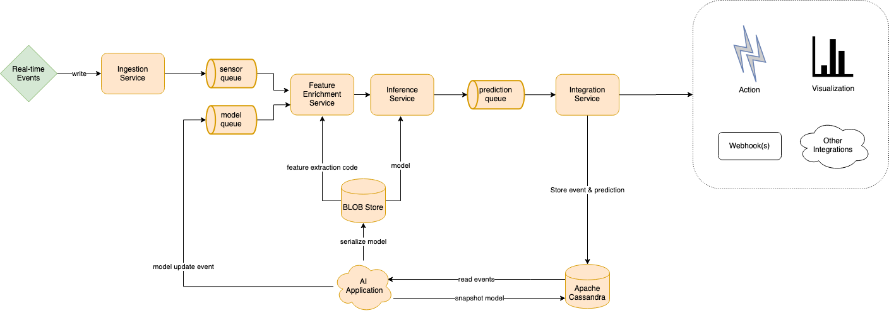

# REFIT
This is a monorepo for the Center for Deep Learning IoT platform, REFIT. REFIT enables data science teams and researchers to decouple the deployment and management of machine learning infrastructure from the data science pipeline. For more information about REFIT or the Center for Deep Learning, visit the [project page](https://www.mccormick.northwestern.edu/research/deep-learning/projects/iot.html) 

## Architecture

## Components
The codebase of REFIT is organized in several bounded contexts. Each bounded context is meant to be independent of one another in its implementation and dependencies. 

- Core: Shared code among all modules. 
- Data: The bounded context that contains base implementations of repositories that deal with the core REFIT domain
    - Data-Cassandra: Implementation of base cassandra repositories
    - Data-Kafka: Implementation of base kafka repositories
    - Data-MinIO: Implementation of base MinIO repositories
    - Data-Postgres: Implementation of base PostgreSql repositories
- Demo: The bounded context that contains the demo-application runner
- Inference: The bounded context that contains the scala project for the [Flink](https://flink.apache.org/) streaming application. This project contains the implementation of the inference engine
    - Inference-Application: The entrypoint of the inference application
    - Inference-Core: The core module of the inference application. This contains the logic to perform model evaluation
    - Inference-[Minio](https://min.io/): The BLOB-Store repository implementation. 
- Ingestion: The bounded context that contains the ingestion service as shown in the architecture diagram.
    - Ingestion-Application: The [Apache Camel](https://camel.apache.org/) application that hosts the ingestion service
    - Ingestion-Cassandra: Implementation of cassandra-specific repositories for the ingestion service
    - Ingestion-Core: Core business logic for the ingestion service
    - Ingestion-Kafka: Implementation of kafka-specific repositories for the ingestion service
    - Ingestion-MinIO: Implementation of MinIO-Specific repositories for the ingestion service
- Integrations: The bounded context that contains the integrations service
    - Integrations-Application: The Apache Camel application that hosts the integrations service
    - Integrations-Grafana: The bounded context that contains the grafana integration
        - Grafana-Camel: The Apache Camel specific module of the grafana implementation
        - Grafana-Cassandra: The Apache Cassandra repositories for the grafana integration
        - Grafana-Core: The core grafana module, containing business logic
    - Integrations-Notebook: The bounded context that contains the Jupyter-Notebook Integration
        - Notebook-Camel: The Apache Camel specific module of the [Jupyter Notebook](https://jupyter.org/) integration
        - Notebook-Cassandra: The Apache Cassandra repositories for the notebook integration
        - Notebook-Kafka: The Apache Kafka repositories for the notebook integration
        - Notebook-MinIO: The MinIO repositories for the notebook integration
- Prediction: The bounded context that contains the implementation of the prediction domain
    - Prediction-Camel: The Apache Camel specific module that is used to define routes for persisting predictions
    - Prediction-Cassandra: The Apache Cassandra repositories for the prediction context
    - Prediction-Core: Business logic that defines the behaviour of the prediction domain in REFIT
- Protocol: Shared module that contain REFIT [Protocol Buffers](https://developers.google.com/protocol-buffers)
- Scheduler: The bounded context that contains the implementation of the distributed REFIT Scheduler
    - Scheduler-Camel: The bounded contexts that contain camel modules for seperate deployments of the scheduler applciation
        - Scheduler-Ingestion: The camel module that defines routes used in the ingestion service
        - Scheduler-Integrations: The camel module that defines routes used in the integrations service
    - Scheduler-Core: Core buinsess logic that determines the behaviour of the REFIT Scheduler
    - Scheduler-JDBI: [JDBI](https://jdbi.org/) Repositories that connect to the PostgreSql database
    - Scheduler-Kafka: Apache Kafka repositories for the scheduler application
    - Scheduler-Kube: [Kubectl](https://kubernetes.io/docs/tasks/tools/install-kubectl/) repositories that enable REFIT to dynamically schedule pods
    
    
    
### Running
#### Prerequisites
Before running REFIT locally, first install the following
- [Docker](https://docs.docker.com/engine/install/)
- [Docker-Compose](https://docs.docker.com/compose/install/)

#### Steps
- Open the [Scala SBT project in IntelliJ IDEA](https://www.jetbrains.com/help/idea/sbt-support.html)
- Open a terminal in the REFIT repository
- Start the core services using docker-compose
    `docker-compose build && docker-compose up -d`

#### Executing tests
- To run individual tests in IDEA
    - Right click the Scala Project
    - Click "Run ScalaTests"
- To run all tests
    - Open the SBT Shell
    - run `sbt test`

### Deployment
In order to deploy REFIT to your own cluster. Follow these instructions. 

#### Prerequisites
- [Kubectl](https://kubernetes.io/docs/tasks/tools/install-kubectl/)
- An existing kubernetes cluster

### Instructions
- Clone the [REFIT-Helmchart](https://github.com/refit-ml/refit-helmchart) repository
    `git clone git@github.com:refit-ml/refit-helmchart.git`
- Update helm repositories
    `helm repo update`
- Lint the REFIT Helmchart
    `helm lint ./refit`
- Update REFIT dependencies
    `helm dependency update`
- To install a new REFIT cluster
    `helm install refit ./refit --namespace refit -f values.yaml`
- To upgrade an existing REFIT cluster
    `helm upgrade refit ./refit --namespace refit -f values.yaml`